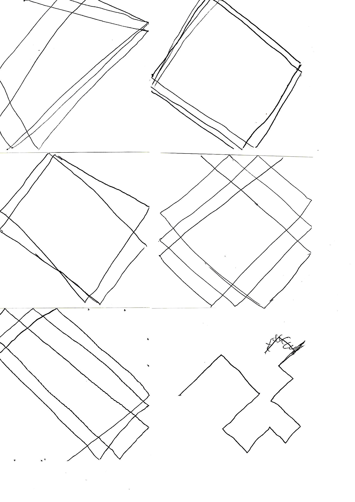
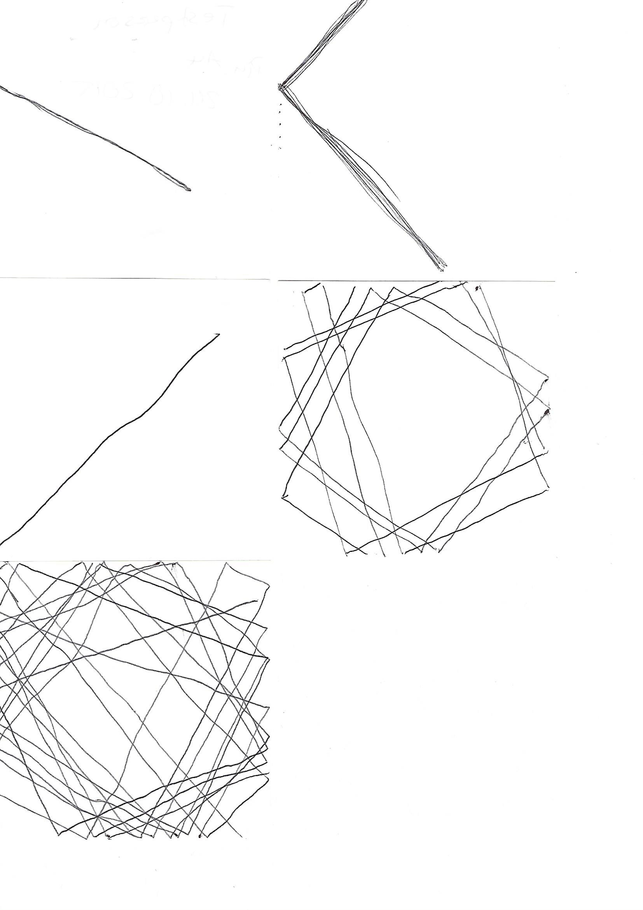
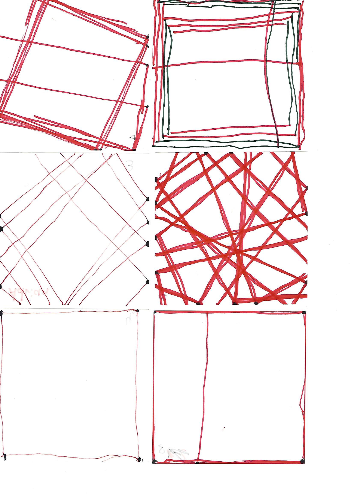
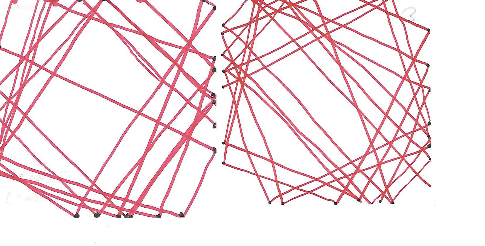
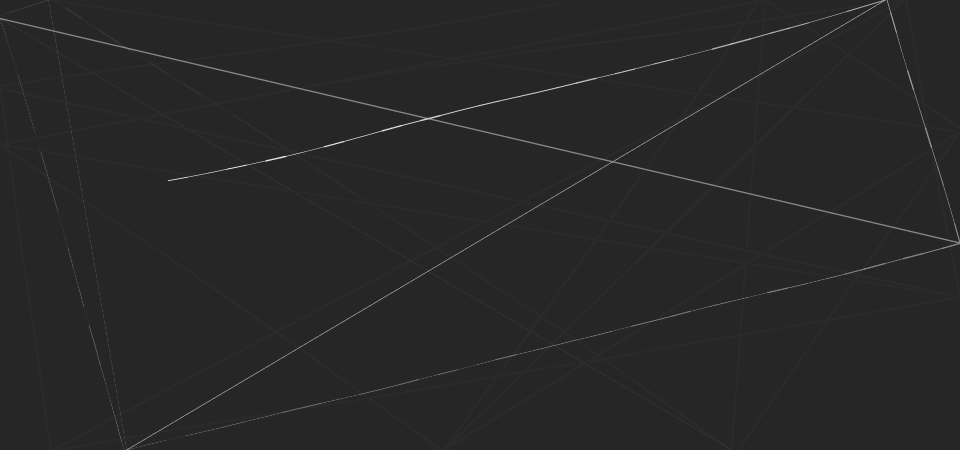
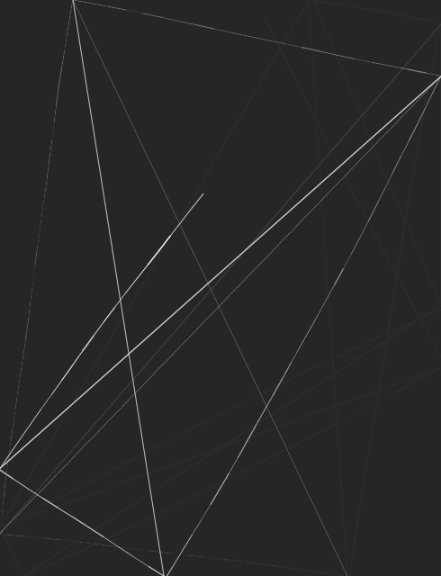
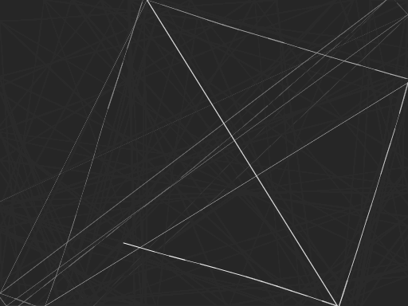
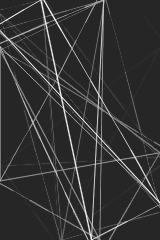
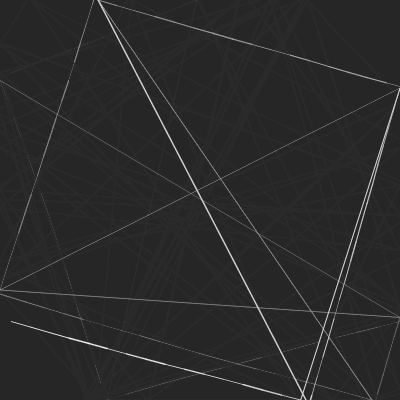

# Bounce Algorithm

[University of Applied Sciences Potsdam](http://www.fh-potsdam.de/)  
Semester: Winter 2015/16  
Course: [11EG-B: Eingabe/Ausgabe (Steel Ant)](https://incom.org/workspace/6176)  
Supervisor: [Fabian Morón Zirfas](https://fhp.incom.org/profil/270)

This Project was realized with [P5js](http://p5js.org), a Processing library for JavaScript, during the course *Eingabe/Ausgabe* at the *University of Applied Sciences Potsdam*.

## Beginnings
Our first assignment was to create an *analog algorithm* and let our course-mates solve it. 
It was very rudimentary and not very precise, which made us think about formulating it even better. 

Several changes had to be made to come up with the first iteration for other people, instead of our course-mates, to solve:

**Final digital result: [here](http://miduku.github.io/bounce-algorithm/html-algorithm/index.html)**

### v1.0a

	German:
	1. Setze den Stift an einer beliebigen Stelle am Rand der Zeichenfläche an.
	2. Zeichne eine gerade Linie in beliebiger Richtung, jedoch so, dass sie nicht 90° oder 0° vom Rand positioniert ist. 
	3. Falls man den Rand der Zeichenfläche erreicht, ändere die Richtung um 90° und führe die Zeichnung fort.
	4. Nach der 10. Richtungsänderung, führe die Zeichnung fort bis der Rand der Zeichenfläche erreicht wurde.
	5. Hebe den Stift an und wiederhole den ersten Schritt so oft wie man mag.
	Verwende einen beliebigen schwarzen Stift. 
	Zeichne auf einem weißen quadratischen Notizzettel.
	Keine weiteren Werkzeuge dürfen verwendet werden
	
	English:
	1. Put down pen at any place of the edge of the artboard.
	2. Draw a staight line in any direction but it mustn't be positioned 90° or 0° from the edge.
	3. If you arrive at the edge of the artboard, change the direction to 90° and continue drawing.
	4. After repeating changing direction 10 times, continue drawing the line until you arrive at the edge of the artboard.
	5. Lift the pen and repeat step 1 as often as you like.
	Use any black pen.
	Draw on white square notepaper.
	No other tools may be used.

### Result

## Continuation
As one can see, the first iteration of the analog algorithm resulted in different results. Our next assignment was therefor to edit the whole code even more to see what the changes will result to.

For this second iteration we asked people again to solve it:

### v1.1a
	German:
	Lese alle Schritte gründlich durch, verwende die beigelegten Stifte (schwarz, rot) und zeichne auf den beigelegten Zettel.
	Zähle und merke dir wieviele Handfalten du auf deiner linken Hand hast. Schreibe diese Zahl zusätzlich unten rechts auf die Rückseite des Zettels auf.
	Keine weiteren Werkzeuge dürfen verwendet werden.
	1. Fange am oberen Rand der Zeichenfläche an mit dem roten Stift eine gerade Linie zu zeichnen; Die Linie muss einen anderen Rand erreichen.
	2. Beim Erreichen des Randes, setze dort einen schwarzen Punkt. Ändere die Richtung um einen rechten Winkel und führe die Zeichnung (wie im ersten Schritt) mit dem roten Stift fort.
	3. Wiederhole die ersten beiden Schritte 9 mal. Führe die letzte Zeichnung fort bis der Rand der Zeichenfläche erreicht wurde.
	4. Hebe den Stift an und wiederhole alle Schritte (ab dem ersten) so oft wie die Anzahl deiner Handfalten.
	
	English:
	Thoroughly read all the steps, use the given pens (black, red) and draw on the given piece of paper.
	Count and remember how many hand wrinkles you have on your left hand. Write down this number on the lower right of the back of the piece of paper.
	No other tools may be used.
	1. Start from the upper edge of the canvas and continuously draw a straight line with the red pen; The line must reach another edge.
	2. Upon reaching the edge, place a black dot there. Change your direction to a right angle und continue your drawing (like in step one) with the red pen.
	3. Repeat the first two steps 9 times. Continue drawing the last line until you reach the edge of the canvas.
	4. Lift the pen and repeat all steps (from the first) as often as the amount of your hand wrinkles.

### Result 2

## Digital translation

Our final assignment of the project was to translate our analog algorithm into a digital one. We wrote our code in JavaScript using P5js. 

Since I only implemented one rule into my algorithm at first (turning ninety degrees at the edge of the canvas), I had to think of a second one to make it more *interesting*.
The second rule was then to connect the corners with an additional line to create triangles every time the line reaches the edge.

### Result 3

